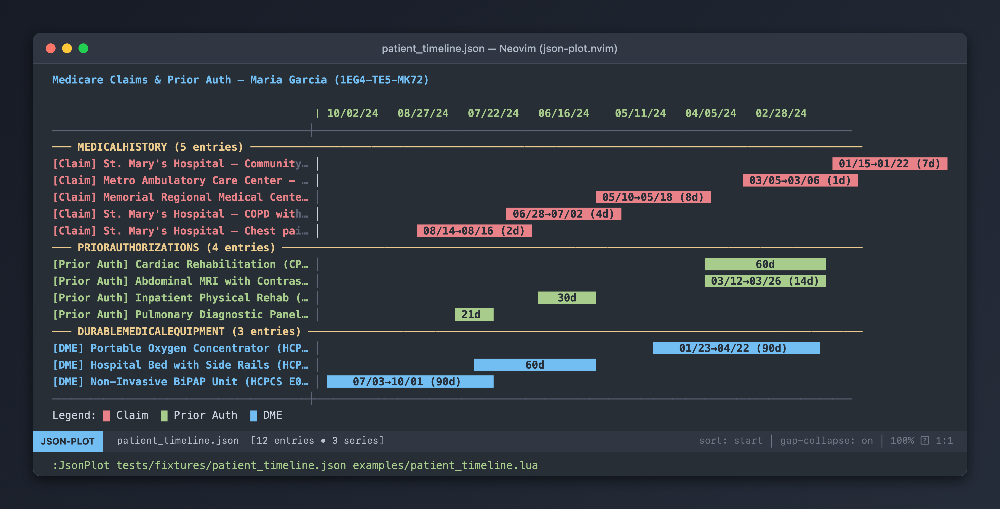

# json-plot.nvim

A Neovim plugin that reads JSON files with time-series data and renders interactive ASCII Gantt charts in a buffer. Define multiple plot series with a fluent Lua API config file — each with its own data source, field mappings, colors, and tags.




## Features

- 📊 **ASCII Gantt chart** rendered with Unicode block characters and extmark colors
- 🔧 **Fluent config API** — define multiple series from different JSON paths
- 📅 **Computed end dates** — `end_computed("requestDate", "authorizedDays")` for medical authorization and service durations
- 🎨 **Color-coded** bars per series/tag via hex colors
- 🔍 **Interactive** — zoom, sort, filter by date range or tag, detail popup
- 🔄 **Hot-reloadable** — `:JsonPlotReload` for development without restarting Neovim
- 📋 **Interactive fallback** — works without a config file via `vim.ui.select` prompts

## Installation

### lazy.nvim

```lua
{
  "pradhyu/neovim-json-visualizer",
  config = function()
    require("json_plot").setup()
  end,
}
```

For local development:

```lua
{
  dir = "~/git/neovim-json-visualizer",
  config = function()
    require("json_plot").setup()
  end,
}
```

### packer.nvim

```lua
use {
  "pradhyu/neovim-json-visualizer",
  config = function()
    require("json_plot").setup()
  end,
}
```

### Manual / vim-plug

Add the plugin directory to your runtimepath:

```vim
set runtimepath+=~/git/neovim-json-visualizer
```

Then in your `init.lua`:

```lua
require("json_plot").setup()
```

## Quick Start (CMS Medicare Claims & Medical Requests)

### 1. Create a JSON data file (`data.json`)

```json
{
  "beneficiary": {
    "name": "Maria Garcia",
    "medicareBeneficiaryId": "1EG4-TE5-MK72"
  },
  "medicalHistory": [
    {
      "facility": "St. Mary's Hospital",
      "admitDate": "2024-01-15",
      "dischargeDate": "2024-01-22",
      "diagnosis": "Community-acquired pneumonia (J18.9)",
      "type": "Inpatient Hospital"
    },
    {
      "facility": "Memorial Regional Medical Center",
      "admitDate": "2024-05-10",
      "dischargeDate": "2024-05-18",
      "diagnosis": "Acute systolic heart failure (I50.21)",
      "type": "Inpatient Hospital"
    }
  ],
  "priorAuthorizations": [
    {
      "serviceType": "Cardiac Rehabilitation (CPT 93798)",
      "requestDate": "2024-01-25",
      "authorizedDays": 60,
      "decision": "Approved"
    },
    {
      "serviceType": "Inpatient Physical Rehab (HCPCS H2014)",
      "requestDate": "2024-05-19",
      "authorizedDays": 30,
      "decision": "Approved"
    }
  ]
}
```

### 2. Create a config file (`.json_plot.lua`)

```lua
local tl = require("json_plot.builder")

tl.title("Medicare Claims & Prior Auth — Maria Garcia")

-- Series 1: Inpatient / Outpatient Hospital Claims
tl.plot("medicalHistory")
  :label("facility")
  :sublabel("diagnosis")
  :start("admitDate")
  :end_date("dischargeDate")
  :tag("Claim")
  :color("#e06c75")

-- Series 2: CMS Prior Authorization & Service Requests (Da Vinci PAS)
tl.plot("priorAuthorizations")
  :label("serviceType")
  :start("requestDate")
  :end_computed("requestDate", "authorizedDays")
  :tag("Prior Auth")
  :color("#98c379")

tl.sort("start")
```

### 3. Open the chart

```vim
:JsonPlot data.json .json_plot.lua
```

Or if `.json_plot.lua` is in the same directory as the JSON file:

```vim
:JsonPlot data.json
```

## Config API Reference

### Plot Definition

```lua
local tl = require("json_plot.builder")

tl.plot("jsonPath")           -- Create series from JSON key (supports dot notation)
  :label("fieldName")         -- Label field (string or function)
  :label(function(e) return e.name .. " (" .. e.id .. ")" end)
  :sublabel("fieldName")      -- Secondary label appended in parens
  :start("fieldName")         -- Start date field
  :end_date("fieldName")      -- Explicit end date field
  :end_computed("startField", "durationField")  -- end = start + duration (days)
  :end_computed_expr(function(e) return e.weeks * 7 end)  -- Custom duration calc
  :tag("SeriesName")          -- Tag shown as [Tag] prefix + legend
  :color("#hex")              -- Hex color for bars
  :filter(function(e) return e.status == "active" end)  -- Predicate filter
```

### Global Settings

```lua
tl.title("Chart Title")       -- Chart title (displayed at top)
tl.sort("start")              -- Default sort: "start", "end", "duration", "label"
tl.date_format("%Y-%m-%d")    -- Date parsing format
```

## Keybindings (in chart buffer)

| Key | Action |
|-----|--------|
| `q` | Close the chart |
| `+` / `=` | Zoom in |
| `-` | Zoom out |
| `p` | Toggle track packing |
| `o` | Toggle overlap panel |
| `s` | Cycle sort order |
| `c` | Toggle gap collapse |
| `f` | Filter by date range |
| `F` | Filter by tag/series |
| `r` | Reset all filters & zoom |
| `w` | Export to Markdown |
| `Enter` | Show entry details |
| `?` | Show help |

## Commands

| Command | Description |
|---------|-------------|
| `:JsonPlot <data.json> [config.lua]` | Open timeline chart (alias: `:TsdbPlot`) |
| `:JsonPlotReload` | Hot-reload plugin for development (alias: `:TsdbPlotReload`) |

## Config File Discovery

The plugin looks for a config file in this order:

1. **Explicit argument**: `:JsonPlot data.json my_config.lua`
2. `.json_plot.lua` in the same directory as the JSON file
3. `json_plot.config.lua` in the same directory
4. `.tsdb_plot.lua` in the same directory
5. `tsdb_plot.config.lua` in the same directory
6. `.timeline.lua` in the same directory
7. **Fallback**: Interactive `vim.ui.select` field selection

## Development

### Hot Reload

During development, use `:JsonPlotReload` to clear Lua module caches and re-require all plugin modules without restarting Neovim.

### Running Tests

```bash
nvim --headless -u tests/minimal_init.lua -c "PlenaryBustedDirectory tests/"
```

## Examples

See the `examples/` directory for complete config files:

- `patient_timeline.lua` — Inpatient/Outpatient Medicare claims + Prior Authorization requests + DMEPOS equipment
- `prior_authorization_monitor.lua` — CMS Da Vinci PAS Inpatient Pre-Certifications + Advanced Diagnostic Imaging + DME requests
- `care_coordination.lua` — SNF → Home Health → Outpatient Therapy → DME continuum

Each has a matching JSON fixture in `tests/fixtures/`.

## License

MIT

